这是一套简洁的 [Typecho](https://typecho.org/) 双栏博客主题，也是 [我的博客](https://www.misterma.com/) 之前使用的主题。

我现在使用的主题是 [Facile](https://github.com/changbin1997/Facile) ，有兴趣的话也可以访问 [我的博客](https://www.misterma.com/) 或 [Github](https://github.com/changbin1997/Facile) 查看。

主题演示地址：[https://changbin1997.github.io/MWordStar/web/](https://changbin1997.github.io/MWordStar/web/)

主题演示站只是静态页面，不能发评论和点赞。

主题下载地址：[https://github.com/changbin1997/MWordStar/releases](https://github.com/changbin1997/MWordStar/releases)

主题使用说明：[https://mwordstar.misterma.com/](https://mwordstar.misterma.com/)

留言板：[https://www.misterma.com/msg.html](https://www.misterma.com/msg.html)

遇到问题可以到留言板留言。

下面是主题首页截图：

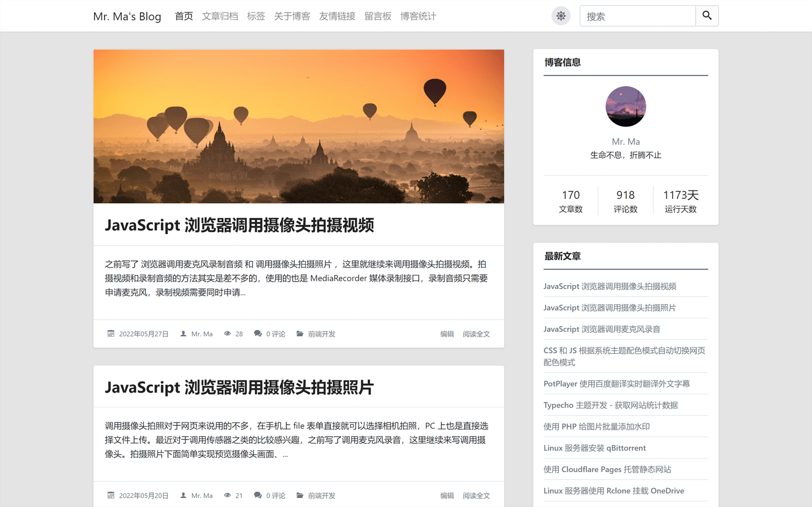

主题元素包含圆角和直角两种风格，您可以根据喜好在主题外观设置中切换，下面是直角风格的首页截图：

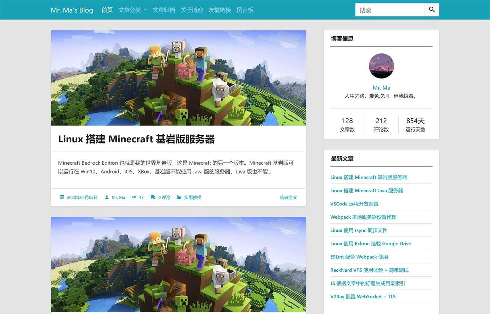

小头图模式：

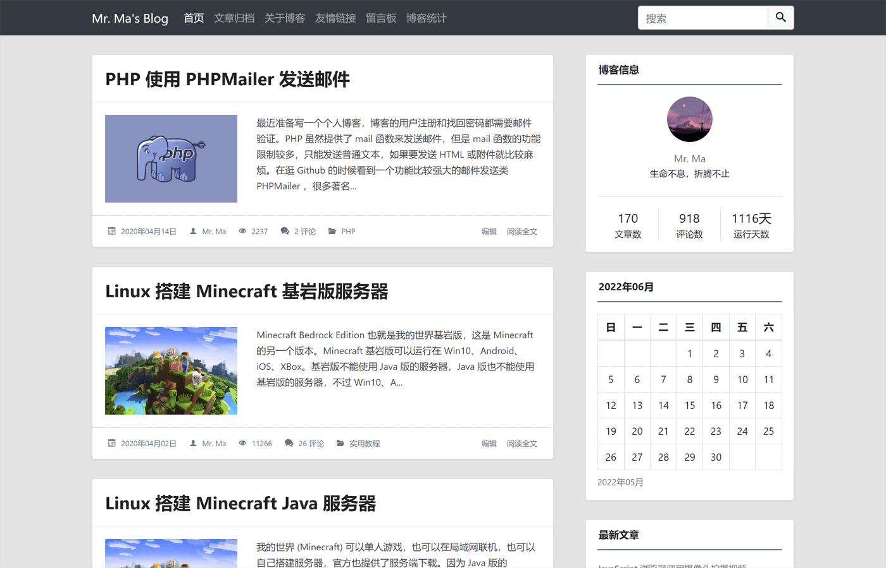

也可以给文章设置单独的头图样式：

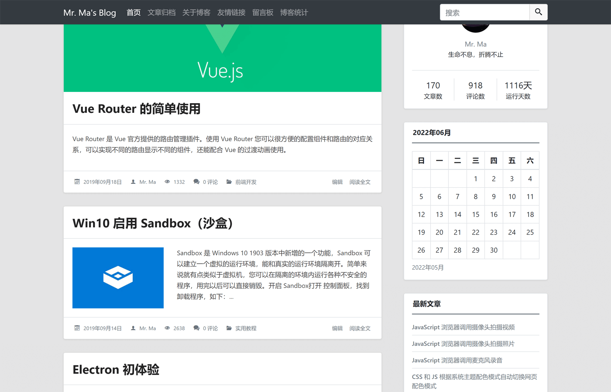

深色模式：

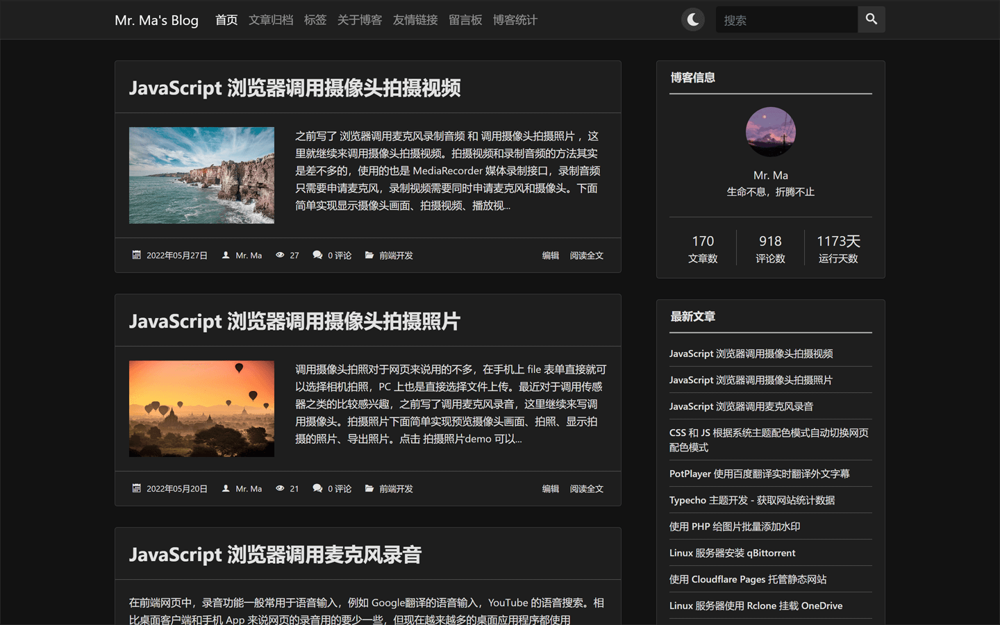

主题目前包含 6 种配色：

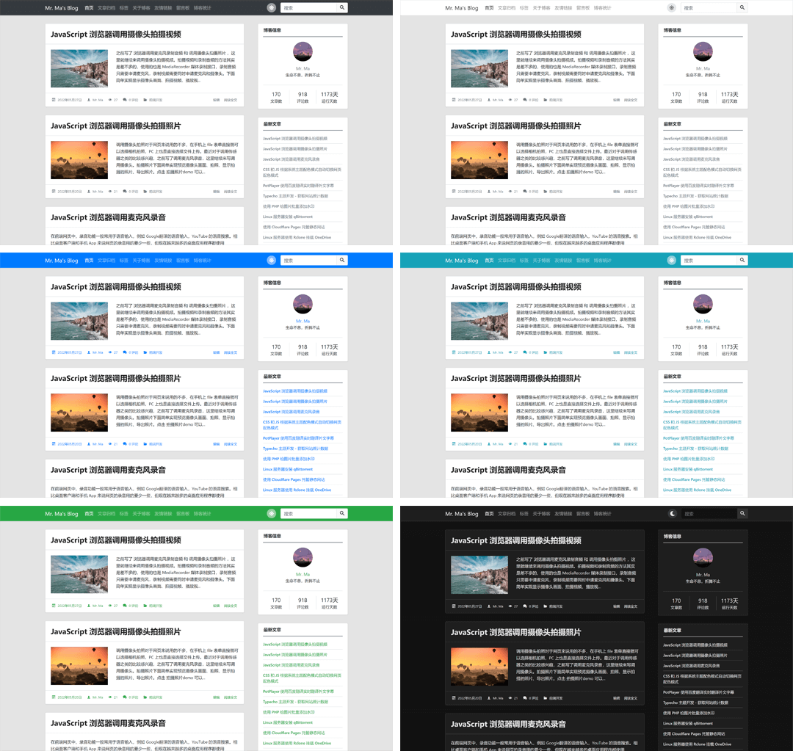

## 特点和功能

* 响应式设计
* 无障碍适配（Accessibility）
* 6 种不同风格的配色
* 两种不同风格的元素
* 多套自定义页面模板
* 代码高亮
* 丰富的设置选项
* 良好的 SEO 优化
* 详细的图表统计
* 自带点赞功能
* 丰富的侧边栏组件
* 评论区自带 Emoji 表情面板
* 自动根据文章中的标题生成章节目录
* 支持图片懒加载
* 长期维护
* 详细的 [使用说明](https://mwordstar.misterma.com/)（必看）

## 主题介绍

### 外观设计

因为我个人比较喜欢两栏布局，所以这个主题也使用了两栏布局的设计。

### 主题依赖

主题主要用到了一下几个库和框架：

- [Bootstrap](https://getbootstrap.com/)  外观和布局
- [jQuery](https://jquery.com/)  Bootstrap 依赖
- [jquery-qrcode](https://github.com/jeromeetienne/jquery-qrcode) 一个生成二维码的 jQuery 插件
- [highlight.js](https://highlightjs.org/)  代码高亮
- [IcoMoon](https://icomoon.io/)  字体图标

其中 IcoMoon 的字体图标是可定制的，所以只包含了主题中出现的图标，字体图标的文件体积也很小。

主题的静态文件没有使用任何 CDN 地址，所有文件都放在主题的 `assets` 目录中。主题的生成目录、点赞、快速分享 之类的功能都是自己手动编写的，所以用到的 JS 库也比较少。

使用 Webpack 打包的版本前台只需要加载一个 CSS 和 一个 JS 文件，所有 JS 库都打包到了 JS 中，所有 CSS 和字体图标都打包到了 CSS 中。因为用到的库比较少，而且字体图标和部分组件都是按需引入的，所以打包后的 CSS 和 JS 也比较小。

本项目还需要感谢 [JetBrains](https://www.jetbrains.com/?from=MWordStar) 免费提供的开发工具。

### 主题安装

把主题上传到 Typecho 的 `usr/themes/` 目录，然后解压，您也可以先解压在上传。

解压后需要保证 `themes` 目录下 有一个 `MWordStar` 目录。

登录 Typecho 的后台管理，进入 `控制台` -> `外观`，如果看到 **MWordStar** 就点击 `启用`。

### 代码高亮

代码高亮目前包含三套主题配色，分别是 Stack Overflow（浅色）、VS2015（深色）、Sunburst（高对比度）。主题支持 30 多种语言的代码高亮，详细的语言支持列表和说明可以查看 [使用说明](https://mwordstar.misterma.com/docs/doc13) 。

### 友情链接

友情链接分为 `全站友情链接`、`首页友情链接`、`内页友情链接`。`全站友情链接` 会在每个页面的侧边栏显示，`首页友情链接` 会在首页的侧边栏显示，`内页友情链接` 只会在 友情链接 的页面显示。

如需查看友情链接的设置说明可以访问：[使用说明](https://www.misterma.com/archives/819/) 。

### 文章头图

文章头图可以在 首页、文章页、侧边栏 显示，您可以根据需求在主题外观设置中设置。文章头图来源支持自动获取文章的第一张图片和手动输入图片 URL。

### 侧边栏

下面是目前可以显示在侧边栏的组件：

* 博客信息
* 搜索
* 最新文章
* 最新评论
* 文章分类
* 标签云
* 日历归档
* 按月份的文章归档
* 登录入口和 RSS
* 友情链接

侧边栏的每个组件您都可以选择开启或关闭，您还可以自定义侧边栏的组件排序顺序。

### 无障碍（Accessibility）

上网对于大多数人来说是一件再简单不过的事，但是对于一些身体有缺陷的残障人士来说却是一件非常困难的事。

目前国内的很多网站都只注重外观，忽略了残障人士的可访问性。但是想要做好网站的用户体验，[无障碍](https://www.misterma.com/archives/264/) 适配肯定是少不了的。

主题针对屏幕阅读器做了大量优化，并 在 [NVDA](http://www.nvda-project.org/) 和 [VoiceOver](https://www.apple.com/cn/accessibility/iphone/vision/) 这两款屏幕阅读器上做过测试，无论是 PC 还是移动设备都能完美朗读。主题能准确传达需要朗读的内容和信息，对于盲人来说，使用标准的屏幕阅读器基本可以无障碍操作。

主题可完美支持键盘访问，颜色对比度也符合标准。

小提示：如果您是屏幕阅读器用户，为了您的浏览体验，不建议使用 IE 浏览器。

### Emoji 表情

主题评论区包含一个 Emoji 表情面板，您可以在后台启用或禁用。Emoji 表情面板包含 1466 个表情，这些表情都是按照分类动态加载的，您不用担心性能问题。

Emoji 表情面板也进行了无障碍适配，可支持键盘访问和屏幕阅读器朗读。

下面是 Emoji 表情面板的截图：

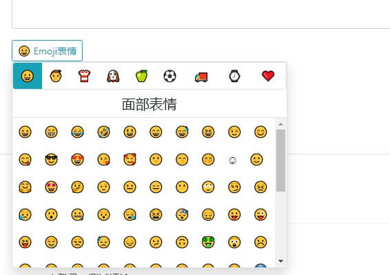

### 统计页

主题包含一个统计页模板，您可以在后台创建页面，页面的自定义模板选择 `网站数据`，标题可以随便写，创建完成后就可以在顶部导航栏访问了。

统计页包含基本的数据统计、分类文章占比图、文章更新日历图、评论动态日历图、阅读量排名前 5 的文章、评论量排名前 5 的文章。

基本数据统计如下：

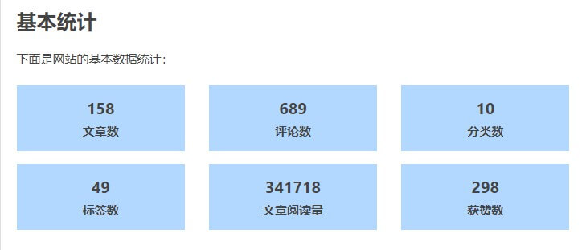

分类占比统计图如下：

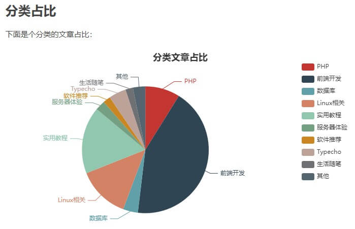

下面是评论动态日历图：

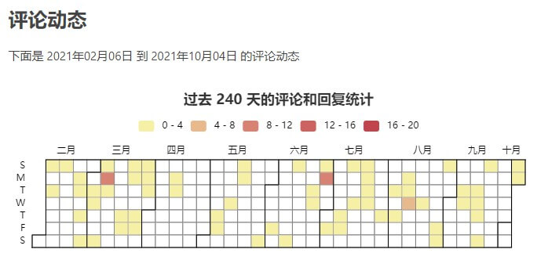

文章动态日历图和评论动态的日历图是差不多的，屏幕尺寸不同显示的月份数量也不同。

下面是文章评论排名表格：

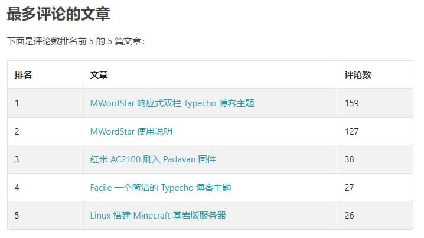

文章阅读量排名表格和评论量排名的表格也是差不多的。

统计页面效果可以参考 [https://www.misterma.com/data.html](https://www.misterma.com/data.html) ，也可以直接访问 MWordStar 的静态演示站。

### 兼容性

主题使用了少量的 CSS3，浏览器需要达到 IE10 才能完美兼容，IE8 和 9 也能使用，但是有些页面的显示 例如代码高亮和时间线显示可能会出现稍微偏移的情况。

### 插件适配

因为本人很少使用插件，所以目前适配的插件比较少。

下面是已适配的插件：

* [Sticky](https://plugins.typecho.me/plugins/sticky.html) 文章置顶插件

已适配的插件不需要到 PHP 文件中添加插件代码，没有适配的插件可能需要按照插件说明到 PHP 文件中添加相应的插件代码。

## 其它

主题 Github：[https://github.com/changbin1997/MWordStar](https://github.com/changbin1997/MWordStar)

主题使用 [MIT License](https://github.com/changbin1997/MWordStar/blob/master/LICENSE) 开源。

如果您在使用这个主题时遇到 Bug 或有任何问题和建议都可以在 [博客评论区](https://www.misterma.com/archives/812/#comments) 留言，也可以在 Github 的 [issues](https://github.com/changbin1997/MWordStar/issues) 反馈。

## 打赏支持

如果感觉主题用着还可以的话，也可以扫描下方的二维码打赏，金额随意：

非常感谢 ❤️

下面是打赏记录：

| 打赏者 | 金额   | 时间              |
|-----|------|-----------------|
| *伟  | 1.00 | 2022 年 8 月 12 日 |

如果打赏者不希望出现在打赏记录可以发邮件到 email@misterma.com 要求删除。